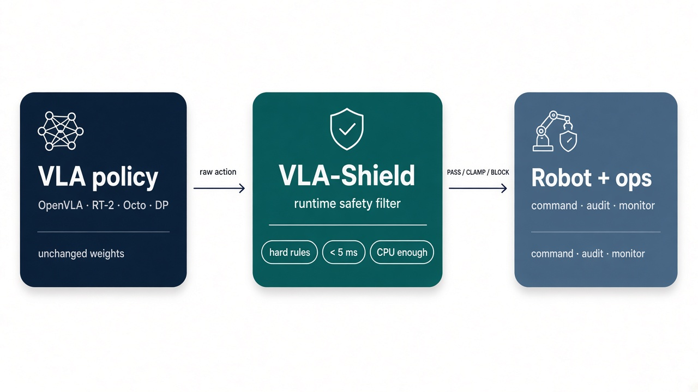
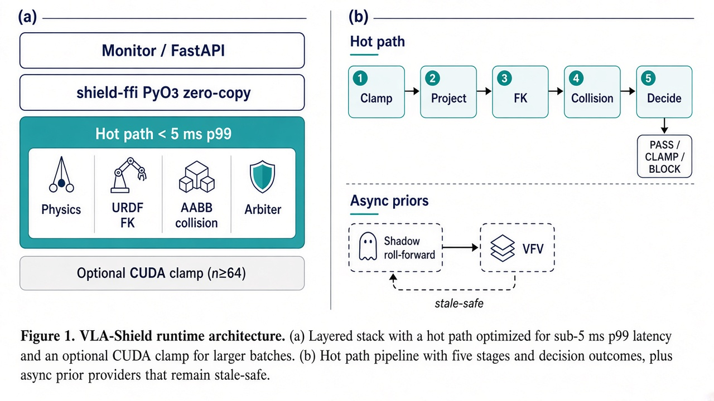
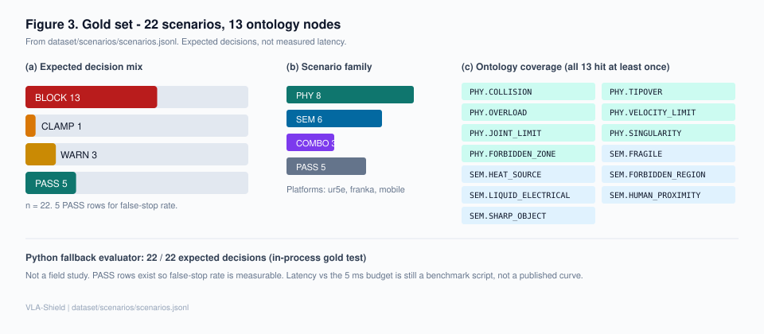
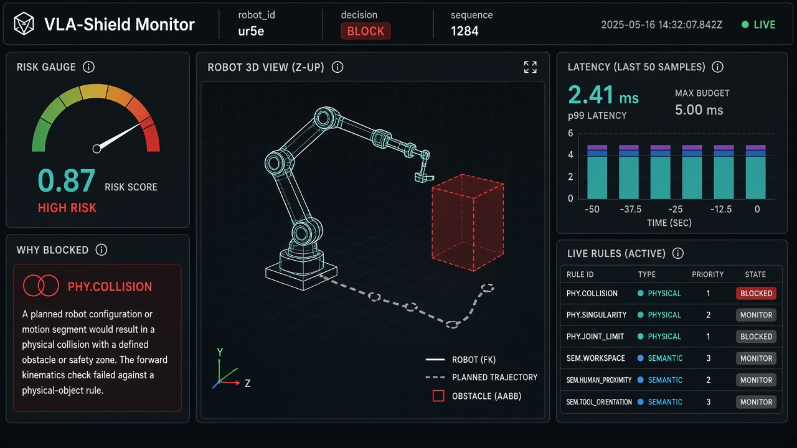

# VLA-Shield

[](LICENSE)
[](https://docs.ros.org/)
[](https://www.rust-lang.org/)
[](https://www.python.org/)
[](https://nextjs.org/)
[](#cuda-acceleration-layer)

**VLA-Shield** is a model-agnostic runtime safety filter for Vision-Language-Action (VLA) policies. It sits after the policy and before the robot: intercept the raw action, project it into kinematics / dynamics, enforce **hard** ontology rules, and emit PASS / CLAMP / BLOCK — without touching model weights.



<p align="center"><em>Figure 1. Placement: unchanged policy weights in, PASS / CLAMP / BLOCK out. The &lt; 5&nbsp;ms number is a hot-path budget, not a published latency curve.</em></p>

---

## Why this exists

Training-time alignment (RLHF, DPO, SafeVLA) changes the policy. VLA-Shield does not. It is middleware you can put in front of OpenVLA, RT-2, Octo, or Diffusion Policy on a CPU — GPU is optional.

- **Zero-touch on the policy** — no fine-tune, no weight patch, no extra training cluster.
- **Hard rules, not a hope** — 13 ontology nodes (`PHY.*` × 7, `SEM.*` × 6) with JSON `trigger_condition`, typed `threshold`, and `action ∈ {block, clamp, warn}`.
- **Hot path vs async priors** — URDF FK, joint / velocity envelopes, AABB, singularity / tip-over / overload run synchronously. Shadow roll-forward and VFV stay off the budget and feed **stale-safe** priors.
- **Gold set you can rerun** — 22 scenarios in `dataset/scenarios/scenarios.jsonl`; Python fallback currently matches all 22 expected decisions.
- **Operators see why** — Redis Stream → WebSocket → Next.js monitor (why-blocked, rule table, 3D twin).

| Approach | Modifies model? | When it runs | Deterministic? | Hardware |
|----------|:---------------:|:------------:|:--------------:|:--------:|
| RLHF / DPO | Yes | Training | No | Multi-GPU cluster |
| SafeVLA | Yes | Training / inference | Soft constraints | Multi-GPU cluster |
| Safety-CHORES | Yes (fine-tune) | Inference | No | GPU + retraining |
| **VLA-Shield** | **No** | **Runtime (budget &lt; 5 ms)** | **URDF + rule engine** | **CPU; GPU optional** |

---

## Architecture

Runtime is a **filter**, not a second policy. Panel (a) is the stack a command actually walks; panel (b) is the five-stage hot path plus async priors that must not stall it.



<p align="center"><em>Figure 2. (a) Layered stack with optional CUDA clamp for n ≥ 64. (b) Clamp → project → FK → collision → decide; shadow / VFV remain stale-safe.</em></p>

| Layer | Crate / module | Role |
|---|---|---|
| Python FFI | `shield-ffi` | PyO3 + numpy zero-copy; per-pipeline CUDA context |
| CUDA (optional) | `shield-cuda` | Action clamp on GPU; CPU ABI fallback |
| Domain | `shield-core` | Ontology, action, arbiter |
| Physics | `shield-physics` | Kinematic projector + PHY.SINGULARITY / TIPOVER / OVERLOAD |
| Kinematics | `shield-urdf` | URDF parse, FK, forbidden zones |
| Collision | `shield-collision` | AABB broad-phase |
| Shadow | `shield-shadow` | Async joint-space roll-forward |
| ROS 2 | `shield-ros2` | Lifecycle, tf2, pipeline (feature-gated) |
| Storage | `shield-io` | MySQL audit + Redis telemetry |
| Backend | `backend/shield/api` | FastAPI + Python evaluator fallback |
| VFV | `backend/shield/vfv` | Visual semantic risk (off hot path) |
| Monitor | `monitor/` | Next.js + Three.js digital twin |

---

## Gold set (real counts)

22 rows in `dataset/scenarios/scenarios.jsonl`. Decisions: **BLOCK 13 · CLAMP 1 · WARN 3 · PASS 5**. Families: PHY 8, SEM 6, COMBO 3, PASS 5. All **13** ontology nodes appear at least once. PASS rows exist so false-stop rate is measurable.



<p align="center"><em>Figure 3. Expected-decision mix, scenario family, and ontology coverage. Not a field study; not a latency plot.</em></p>

Python fallback evaluator: **22 / 22** expected decisions in the in-process gold test. Latency vs the 5 ms budget is `benchmark/run_latency.py --use-ffi`, not a figure here.

---

## Monitor



<p align="center"><em>Figure 4. Concept mock of the Next.js console — risk gauge, 3D twin, why-blocked, stacked latency, live rules. Not a live capture from this repo.</em></p>

---

## Quick Start

### 1 · Rust runtime

```bash
cd runtime
cargo build --workspace
cargo test  --workspace
```

Optional ROS 2 Rust bindings:

```bash
cargo build -p shield-ros2 --features ros2     # requires ROS 2 + Rust overlay
```

### 2 · Python backend

```bash
cd backend
pip install -e ".[dev]"
pytest
```

### 3 · Safety monitor (Next.js)

```bash
cd monitor
yarn install && yarn dev
```

### 4 · ROS 2 messages (requires ROS 2 SDK)

```bash
source /opt/ros/$ROS_DISTRO/setup.bash
colcon build --packages-select vla_shield_msgs
```

### 5 · Docker — full stack

```bash
cp deploy/.env.example deploy/.env
docker compose -f deploy/docker-compose.yml up -d
```

### 6 · Edge — Jetson / ARM64 (API + DB only)

```bash
cp deploy/edge/.env.jetson.example deploy/edge/.env
docker compose -f deploy/edge/docker-compose.jetson.yml up -d
```

### 7 · Python ↔ Rust extension (`shield_ffi`)

```bash
cd runtime/shield-ffi
maturin develop --release                       # CPU clamp backend
maturin develop --release --features cuda       # enables shield-cuda (needs nvcc)
```

---

## CUDA Acceleration Layer

`shield-cuda` is an **optional** crate that accelerates the action-clamp stage on GPU. It builds **without** CUDA installed (a CPU-ABI-compatible fallback is compiled instead), so the rest of the workspace never breaks.

```
src/lib.rs                  Rust safe wrapper (CudaCtx + clamp_into / clamp_action_cuda)
    │ extern "C"
    ▼
src/kernels/cuda_host.cpp   C++ host glue:
    │                         · ShieldCudaCtx { d_*, h_* (pinned), stream }
    │                         · cudaMalloc once · cudaMemcpyAsync · cudaFree on Drop
    │ extern "C"               · grows buffers transparently when n > capacity
    ▼
src/kernels/clamp_kernel.cu CUDA kernel + thin launcher
    ▼
                            GPU
```

| Mode | Trigger | What runs |
|---|---|---|
| Real GPU | `nvcc` on PATH, default | `clamp_kernel.cu` + `cuda_host.cpp` (cudart linked) |
| Forced CPU stub | `CUDA_DISABLE=1 cargo build` | `clamp_stub.cpp` |
| No CUDA toolkit | `nvcc` missing | `clamp_stub.cpp` |
| Small-n bypass | `n < min_gpu_n` (default 64) | Rust scalar loop — **no C ABI, no kernel** |
| Force backend | `SHIELD_CUDA_MIN_GPU_N=0` or `set_min_gpu_n(0)` | C ABI even for tiny `n` (A/B benches) |

```bash
cd runtime
cargo run -p shield-cuda --example bench_clamp --release -- --iters 100000 --dof 8
cargo run -p shield-cuda --example bench_clamp --release -- --iters 100000 --dof 8 --force-gpu
cargo run -p shield-cuda --example bench_clamp --release -- --iters 20000 --dof 256
```

---

## Benchmarking

```bash
# Latency against the live FastAPI server (HTTP path)
python benchmark/run_latency.py --dof 6 --n-actions 10000

# Latency through the Rust FFI (skip HTTP); numpy zero-copy by default
python benchmark/run_latency.py --use-ffi --dof 8 --n-actions 50000
python benchmark/run_latency.py --use-ffi --no-numpy

# Safety recall / precision over the 22-scenario gold set
python benchmark/run_safety.py --scenarios dataset/scenarios/scenarios.jsonl

python benchmark/bench_zero_copy.py --dof 8 --iters 100000
```

`run_latency.py` reports per-stage `p50 / p95 / p99 / mean / max` plus `budget_violation_rate (> 5 ms)`. `run_safety.py` reports `block_recall`, `false_stop_rate`, `hard_block_precision`, and `accuracy`.

---

## Repository Structure

```
vla-shield/
├── README.md
├── LICENSE                                  (Apache 2.0)
├── runtime/                                 Rust real-time shield runtime
├── backend/                                 FastAPI + Python evaluator + VFV
├── monitor/                                 Next.js safety console
├── ros2/vla_shield_msgs/                    Custom .msg / .srv
├── dataset/
│   ├── ontology/                            PHY.* / SEM.* nodes + executable rules
│   ├── scenarios/scenarios.jsonl            22 gold scenarios
│   ├── red_team/                            Red-team JSONL + samples
│   └── urdf/                                Minimal URDF fixtures
├── benchmark/                               Latency + gold-set safety suites
├── docs/
│   ├── figures/                             README figures (placement, architecture, gold set, monitor)
│   └── openapi/shield-ops-v1.yaml           REST + WebSocket schema
└── deploy/                                  Docker Compose + Jetson edge stack
```

---

## Data

**Manual samples** (`dataset/red_team/samples.jsonl`): bilingual (EN / ZH) entries for smoke testing.

**Scenario gold set** (`dataset/scenarios/scenarios.jsonl`): 22 high-risk scenarios with `injected_action`, `current_joints`, `expected_decision`, and `risk_tags` covering all 13 ontology nodes.

```bash
cd backend
pip install -e ".[data]"
python -m shield.data.download
python -m shield.data.validate --data ../dataset/red_team/public.jsonl
```

---

## Citation

```bibtex
@misc{vla-shield-2026,
  title        = {VLA-Shield: A Decoupled Real-Time Safety Filter Layer
                  with Semantic-to-Physics Projection for
                  Vision-Language-Action Policies},
  author       = {The VLA-Shield Contributors},
  year         = {2026},
  howpublished = {\url{https://github.com/Joword/vla-shield}}
}
```

---

## Contributors

- [Joword](https://github.com/Joword)

---

## License

Licensed under **Apache License 2.0**. See [LICENSE](LICENSE) for details.
